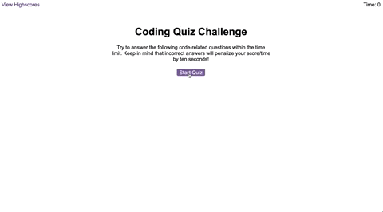

# Code Quiz

## Purpose 

To build a timed coding quiz with multiple-choice questions as per Business Requirements stated below. This app will run in the browser and will feature dynamically updated HTML and CSS powered by JavaScript.

## How to Use

The user is presented with an HTML page with a Start Quiz button. Once the button is pressed the user is presented with questions and multiple choice answers.

Once the user selects an answer next question is presented until the quiz is completed or time runs out. If they get an anwer wrong they are penalized by reducing their time remaining by 10 seconds.

Once the quiz is over a score is displayed to the user and the user can iput their initials.

After the user enters their intitials their score is stored locally for the duration of the browser session. The user can view the top 10 highest scores, or they can go back to retake the quiz.


## Business Requirements

### User Story

```
AS A coding boot camp student
I WANT to take a timed quiz on JavaScript fundamentals that stores high scores
SO THAT I can gauge my progress compared to my peers
```

### Acceptance Criteria

```
GIVEN I am taking a code quiz
WHEN I click the start button
THEN a timer starts and I am presented with a question
WHEN I answer a question
THEN I am presented with another question
WHEN I answer a question incorrectly
THEN time is subtracted from the clock
WHEN all questions are answered or the timer reaches 0
THEN the game is over
WHEN the game is over
THEN I can save my initials and my score
```

### Mock-Up

The following animation demonstrates the application functionality:



## Deployment

### URL 

https://pav1593.github.io/code-quiz/

### Github

https://github.com/pav1593/code-quiz
